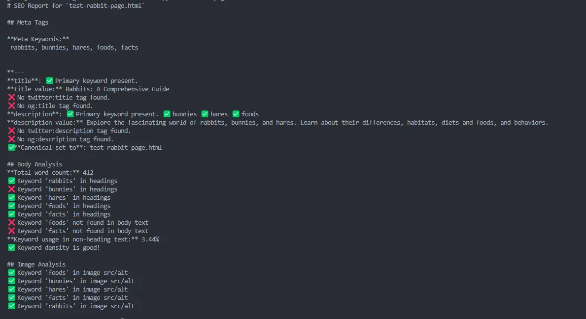

# Seo Check 
A simple script to check SEO for different things. 

## Local or Remote
Useful when using SSG or html files. 
Can also be used to check remote sites. 


## Useage 
```sh
./seo-check.py test-rabbit-page.html
./seo-check.py example.com
```



- Note: Expects you have have metakeywords. 
- Also if page set to noindex or none it wil report this and halt check. 


